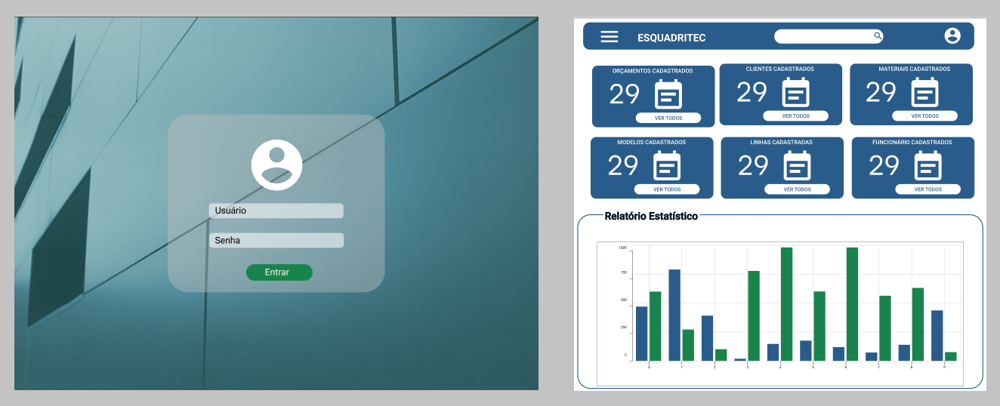

# ESQUADRITEC

### **Sistema para gerenciamento de orçamentos para a matéria de web II do curso de Análise e Desenvolvimento de Sistemas**

<!--  -->

<!--  -->

 ### O sistema foi projetado e desenvolvido com o auxílio das seguintes ferramentas:
>  - **Modelagem**
> -  -  Mysql Workbench 
> -  -  Figma
> - **Banco de Dados**
> - -  MySQL
> - **Ferramentas para codificar**
> - -    Sublime Text
> - -  Visual Studio Code
>  - **Hospedagem**
>  - -  Heroku

### Frameworks Utilizados:
>  -  Bootstrap
>  -  Laravel

 ### Linguagens Utilizadas:
> -  PHP
> -  SQL
> -  Javascript

### **Membros da equipe** 
<table align="center">
	    <tr>
	        <td align="center">
	            <a href="https://github.com/Djalma-Neto">
	                
	                 
	                <b>Djalma Neto</b>
	            </a>
	              Back End 
	        </td>
          <td align="center">
	            <a href="https://github.com/EliveltonCotrim">
	                
	                 
	                <b>Elivelton Cotrim</b>
	            </a>
	              Back End 
	        </td>
	    </tr>
	        <td align="center">
	            <a href="https://github.com/Joedson-Bomfim">
	                
	                 
	                <b>Joedson Bomfim</b>
	            </a>
	              Front End 
	        </td>
	        <td align="center">
	            <a href="https://github.com/samelabrito"> 
			    
	                 
			<b>Sâmela Camelo</b>
	            </a>
	              Front End 
	        </td>
	    </tr>
</table>

<!--
### Acesse o sistema por aqui
- <a alt="sistema esquadritec" href="www.sistema.com">Sistema Esquadritec</a>

-->
